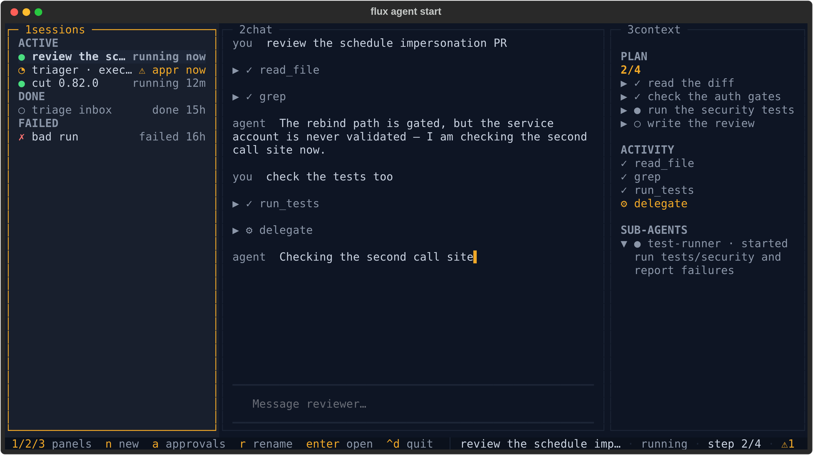
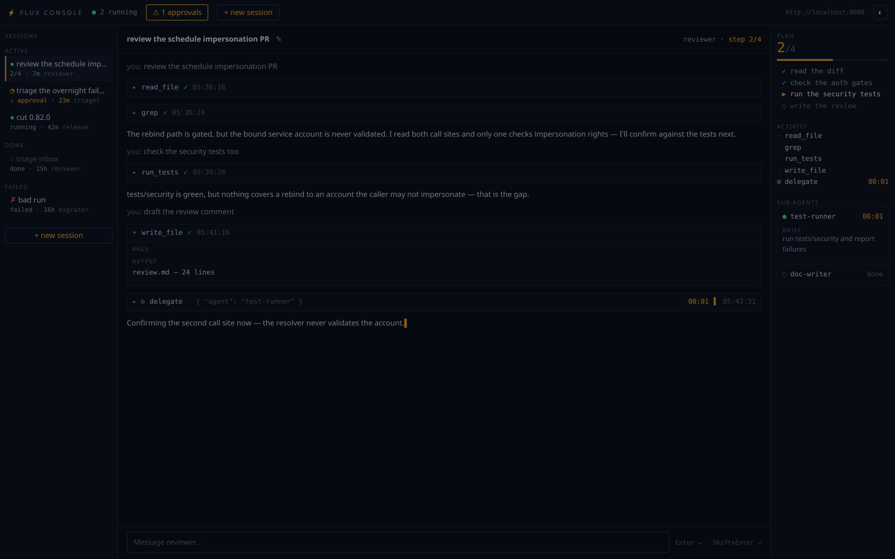
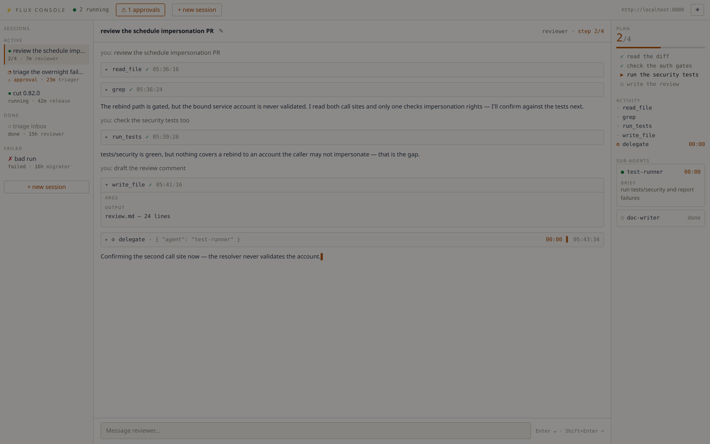

# Agent Console

`flux agent start` opens **mission control** for your agents: every session in
one rail, the open session's transcript in the middle, and its plan, tool
activity and sub-agents on the right — with the approvals queue one keystroke
away.

The console is a client of the Flux server, not part of it. It runs as your
process, with your token, and reads the same REST/SSE surface any other client
would. Two surfaces share one core (`flux/agents/console/`): a Textual terminal
app and a browser app.

## Quick start

```bash
flux agent start                    # console, every agent's sessions (terminal)
flux agent start reviewer           # console focused on a reviewer session
flux agent start --mode web         # same console in the browser (port 8080)
flux agent start --mode api         # headless: JSON + SSE, no renderer
flux agent session resume <id>      # console opened straight into a session
```

`NAME` is optional everywhere. Given, it filters the session rail to that
agent (and labels the header) *and* opens focused on one of its sessions —
the most recent one still going, or a fresh one when there is none. Omitted,
the console is rail-first and shows every agent's sessions. Either way you
pick the agent when you start a new session, so one console can drive them
all.

Terminal mode needs a real terminal. When stdout is not a TTY (piped,
scripted, CI) `flux agent start NAME` falls back to the plain single-agent
REPL, and a NAME-less invocation fails loudly rather than opening a console
that cannot draw. `--plain` (or `FLUX_PLAIN_TERMINAL=1`) forces that REPL
explicitly and requires a NAME.

That check applies to terminal mode only: `web` and `api` render in a browser
or over HTTP, so they start fine from a service manager, container or CI with
no TTY attached.

Options: `--mode terminal|web|api`, `--port`, `--host` (default `127.0.0.1`),
`--allow-remote`, `--allow-origin`, `--server`, `--session <id>`, `--plain`.
The token comes from `$FLUX_AUTH_TOKEN`, else the credentials stored by
`flux auth login`.

## The layout

Both surfaces are the same three regions: **rail**, **stage**, **context**.

### Terminal



- **1 sessions** — every session grouped `ACTIVE` / `IDLE` / `DONE` /
  `FAILED`, one glyph per state (`●` running, `◔` waiting on an approval,
  `◐` idle, `○` done, `✗` failed). `IDLE` is where a healthy session spends
  most of its life: paused, waiting for your next turn. Failed sessions get
  their own group; they are never dimmed in with the finished-normally ones.
- **2 chat** — the transcript: your turns, the agent's replies, and each tool
  call as a collapsible row.
- **3 context** — `PLAN` with a done/total hero figure, `ACTIVITY` (tool calls
  with live timers), `SUB-AGENTS` (delegations, expanded while running).
- The status line carries the hotkeys, the open session's title, its state and
  the pending-approval count.

Below 100 columns the rail and context panels fold away and the hotkeys still
switch between them; below 80 the status line goes compact.

### Web





Same regions, plus a top bar with the running count, the approvals drawer
button, `+ new session`, the server URL and a theme toggle. The theme follows
`prefers-color-scheme` on first load and remembers your choice after that.

## Keyboard

The terminal console's grammar is hotkeys, not focus-follows-typing — the
composer only holds focus while you are actually writing.

| Key | Action |
|-----|--------|
| `1` | Focus the session rail |
| `2` | Focus the chat transcript (scroll it; the composer is *not* focused) |
| `3` | Focus the context panel |
| `enter` | On the rail: open the highlighted session. In chat: step into the composer |
| `escape` | Leave the composer (or close an overlay) and step back to the panel |
| `n` | New session — pick an agent, optionally name it |
| `a` | Approvals overlay — approve/reject, including the standing-grant options |
| `e` | Answer the open session's MCP authorization prompt (accept/decline/cancel) |
| `r` | Rename the open session |
| `x` | Stop the highlighted session — press twice; a cancel is not undoable |
| `ctrl+d` | Quit |

In the browser: `Enter` sends, `Shift+Enter` inserts a newline, `Escape`
closes the approvals drawer, the new-session modal, or an armed stop. The
stage header carries the rename pencil and, for a session that has not
finished, a `◼ stop` button that asks for a second click before it fires.

## What the console shows, and when

The persisted execution log is the source of truth; the live SSE stream is an
overlay on top of it.

- Opening a session renders its transcript, tool calls and approval gates from
  `GET /executions/{id}?detailed=true` — the redacted read path.
- During a turn, progress frames overlay live tokens, reasoning, tool
  start/done ticks, plan revisions and sub-agent lifecycle.
- Every turn ends with one reconciliation read, so a dropped frame or a
  disconnected browser never leaves a stale transcript behind. A stream that
  ends at `PAUSED` is normal: that is the steady state between turns.
- Plans and sub-agent cards come only from progress frames (progress is never
  persisted), so they are live-only detail — reopening a session replays its
  log, not its plan.
- Rail rows for sessions you have *not* opened show only what the cheap
  listings carry (agent, state, age, pending-approval flag). Step counts
  appear on the open session. This is a deliberate v1 limit — no per-row
  detail fetches.

Tool calls are ordinary Flux tasks, so the log carries their real names,
outputs and durations. Two shapes are worth knowing about because the console
handles them for you: executions logged before the engine recorded starts in
resumed runs carry a completion with no matching start, and task outputs are
stored as output-storage envelopes rather than bare values. The
console reconstructs the call from its completion event and unwraps inline
outputs; a value kept outside the log (e.g. `local_file` storage) is named
rather than dumped.

## Permissions

The console never holds authority of its own — every action is the
corresponding server call, made with your token.

| Console action | Server call | Permission required |
|----------------|-------------|---------------------|
| Rail listing, agent picker | `GET /agents/sessions`, `GET /admin/agents` | `agent:*:read` |
| Open a session (transcript, activity, gates) | `GET /executions/{id}?detailed=true` | `execution:*:read` **and** `workflow:{ns}:{wf}:read` |
| Approvals queue | `GET /approvals` | results are scoped to the workflows you can read (`workflow:{ns}:{wf}:read`) |
| New session | `POST /workflows/{ns}/{wf}/run/stream` | `workflow:agents:{workflow}:run` (plus `workflow:agents:{workflow}:task:{task}:execute` for the workflow's declared tasks) |
| Send a turn | `POST /workflows/{ns}/{wf}/resume/{id}/stream` | same as starting a session |
| First spawn of an agent shipping a `workflow_file` | `POST /workflows` | `workflow:agents:*:register` |
| Approve / reject | `POST /executions/{id}/approvals/{call}/approve\|reject` | `workflow:{ns}:{wf}:read` **and** `workflow:{ns}:{wf}:task:{task}:approve` |
| Rename a session | `PUT /executions/{id}/name` | `workflow:{ns}:{wf}:run` — naming an execution is a run-level act, deliberately the same grant as cancelling it |
| Stop a session | `GET /workflows/{ns}/{wf}/cancel/{id}` | `workflow:{ns}:{wf}:run` |

Console sessions live in the `agents` namespace, on `agent_chat` or on the
agent's own `agent_custom_<name>` workflow.

### Read-only degradation

A token that can read but not write gets a usable console, not a broken one.
Every write control — send, new session, rename, stop, approve — is disabled
and labelled with the permission it is missing, rather than failing when you
press it.

The web and headless surfaces learn this before you touch anything: the first
`GET /console/state` runs a side-effect-free probe (a cancel against an
execution id that cannot exist, which the server authorizes *before* it looks
anything up) and returns `can_write` plus `missing_permission`. Naming the
permission there is the only chance to learn it — once every control is
disabled the page can never provoke a 403 of its own. The answer is tracked
per token, never per process, so in `api` mode one caller's denial never
degrades the console for another.

The terminal console runs in-process with no `/console/state` to ask, so it
learns the same thing from the first denied write and then dims its write
hints in the status line. A write denied later (a grant revoked mid-session)
flips the switch on either surface.

## Headless (`--mode api`)

`--mode api` serves the console core with no renderer: JSON and SSE for
scripts, tests, or a UI of your own. Every request carries a Bearer token that
is passed through to the Flux server per request, and every state-changing
request additionally carries `X-Flux-Console: 1` — a header a cross-origin
page cannot set without a preflight, which is what keeps a random website from
driving your console. When the browser sends an `Origin`, it must also match
the console's own.

| Method | Path | Notes |
|--------|------|-------|
| `GET` | `/console/state` | Bound agent, server URL, `can_write`, `missing_permission` |
| `GET` | `/console/agents` | Agents available to spawn, projected to `name`/`model`/`description` — never the full definition |
| `GET` | `/console/sessions` | Rail rows (`derived_title` is the cached display fallback) |
| `GET` | `/console/approvals` | Pending approvals across executions |
| `GET` | `/console/sessions/{id}/detail` | The execution's detailed log |
| `POST` | `/console/sessions` | `{"agent": "...", "name": "..."}` → `{"execution_id": ...}` |
| `POST` | `/console/sessions/{id}/send` | `{"text": "..."}` → SSE; every frame carries the `session_id` it belongs to, and the turn always ends with one `log_delta` frame |
| `POST` | `/console/approvals/{execution_id}/{task_call_id}` | `{"approve": true, "always": false, "always_for_target": false}` → `{"result": "decided"\|"already_decided"}` |
| `POST` | `/console/sessions/{id}/elicitation` | `{"payload": {...}}` |
| `PUT` | `/console/sessions/{id}/name` | `{"name": "..."}` |
| `POST` | `/console/sessions/{id}/stop` | Cancels the session's execution |

```bash
curl -s -X POST http://127.0.0.1:8080/console/sessions \
  -H "Authorization: Bearer $FLUX_AUTH_TOKEN" \
  -H "X-Flux-Console: 1" \
  -H "Content-Type: application/json" \
  -d '{"agent": "reviewer"}'
```

`web` mode serves the same endpoints backed by the operator token set at
process start, so the browser never handles a credential.

## Trust model

The console is single-operator by design: it binds `127.0.0.1`, holds one
operator token, and does no authentication of its own — authorization is
entirely the Flux server's, per call. Three things follow.

**Exposure is a deliberate act.** In `web` mode a non-loopback `--host` exits
1 unless you also pass `--allow-remote`, because reaching the port *is* the
authorization: anyone who can connect lists every session, reads every
transcript, spawns agents, approves gated tasks and cancels executions. When
you do pass it, the console says so at startup. Put a proxy that authenticates
in front, or use `--mode api`, which requires a Bearer on every request and is
the right shape for remote or scripted use.

**The console answers only to its own name.** Bound to loopback, `web` mode
rejects any request whose `Host` header names something else with a 400. That
covers reads as well as writes, because DNS rebinding is a read attack: a page
you visit resolves its own domain to `127.0.0.1` and, without the check, the
browser would treat it as same-origin with your console. The check is dropped
under `--allow-remote` — once the port is genuinely reachable, rebinding buys
an attacker nothing.

**Browsers must prove they are the console's own frontend.** Every
state-changing request needs `X-Flux-Console: 1`, which a third-party page
cannot set without a CORS preflight this app never grants, and — when a browser
sends an `Origin` — a match against the allowlist. If you serve the console
under a hostname, add it with `--allow-origin` (repeatable): a wildcard bind
like `0.0.0.0` never appears in an `Origin` header, so without an explicit
entry a state-changing request from that hostname is rejected with 403.

None of this constrains other processes on your own machine, which can set any
header they like. On a single-operator box local code already runs as you;
closing that would need an OS-level boundary no browser can speak.

## Known follow-ups

Pre-existing issues found while building the console, tracked separately:

1. **Progress SSE bypasses secret redaction.** The REST read paths the console
   renders from are redacted; the server's live progress stream is not, so a
   secret value emitted inside a progress payload reaches a connected client
   unredacted.
2. **`flux agent stop` targets a route that does not exist.** It POSTs to
   `/executions/{id}/cancel` and 404s. The console's stop button uses the
   working workflow-scoped cancel route; from the CLI use
   `flux workflow cancel agents/<workflow> <id>`.
3. **Eager `AgentManager` import in `flux/agents/__init__.py`.** It pulled the
   whole agent stack into any `flux.agents` import, which no honest
   agent-process import budget survives. Fixed on this branch (the package
   imports lazily now), noted here because released versions still carry it.
4. **`/chat`, `/approval` and `/elicitation` were drive-by callable.** The
   pre-console web UI accepted cross-site POSTs on those routes. They are
   removed on this branch — the console's per-session `/console/*` routes
   replace them, behind the `X-Flux-Console` + Origin check described above —
   noted for awareness of released versions.

## See also

- [Agent Harness](agent-harness.md) — defining agents, tools, serving modes.
- [Agent Skills](agent-skills.md) — filesystem-defined agent capabilities.
- [Task Progress Streaming](task-progress.md) — the progress primitive behind
  the live overlay.
