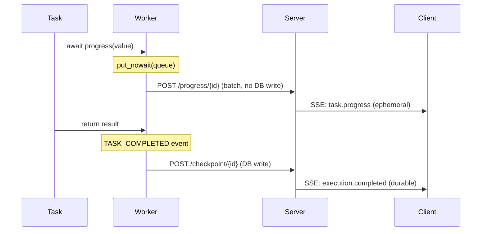

# Task Progress Streaming

Tasks can report progress during execution using the `progress()` function. Progress events are **ephemeral** — they stream to connected clients in real-time but are never persisted, never stored in the database, and never replayed. This makes them ideal for:

- **LLM token streaming** — see agent responses as they generate
- **Data processing updates** — track rows processed, percentage complete
- **Pipeline step reporting** — show which phase is active

## Quick Start

```python
from flux import task, workflow, ExecutionContext
from flux.tasks import progress

@task
async def process_data(items: list):
    results = []
    for i, item in enumerate(items):
        results.append(item * 2)
        await progress({"processed": i + 1, "total": len(items)})
    return results

@workflow
async def my_workflow(ctx: ExecutionContext):
    return await process_data(ctx.input["items"])
```

## Consuming Progress Events

Progress events are delivered via SSE when using stream mode. There are two ways to consume them:

### CLI

```bash
flux workflow run my_workflow '{"items": [1, 2, 3]}' --mode stream
```

### HTTP API

```bash
curl -N -X POST http://localhost:8000/workflows/my_workflow/run/stream \
    -H "Content-Type: application/json" \
    -d '{"items": [1, 2, 3]}'
```

Both produce the same SSE event stream. Progress events use the `task.progress` event type and carry the standard `ExecutionEvent` structure:

```
event: task.progress
data: {"type": "TASK_PROGRESS", "source_id": "process_data_123", "name": "process_data", "value": {"processed": 1, "total": 3}, "time": "2026-03-19 17:50:08.410"}

event: task.progress
data: {"type": "TASK_PROGRESS", "source_id": "process_data_123", "name": "process_data", "value": {"processed": 2, "total": 3}, "time": "2026-03-19 17:50:08.511"}

event: task.progress
data: {"type": "TASK_PROGRESS", "source_id": "process_data_123", "name": "process_data", "value": {"processed": 3, "total": 3}, "time": "2026-03-19 17:50:08.613"}

event: my_workflow.execution.completed
data: {"state": "COMPLETED", "output": {...}}
```

Progress events are interleaved with durable execution state events (`CLAIMED`, `RUNNING`, `COMPLETED`). Clients distinguish them by the `event` field — `task.progress` for ephemeral progress, `{workflow}.execution.{state}` for durable state changes.

**When no stream-mode client is connected** (async or sync mode), progress events are silently dropped. There is zero memory or CPU overhead.

## Agent Token Streaming

The `agent()` task uses `progress()` to stream LLM tokens. Streaming is enabled by default:

```python
from flux.tasks.ai import agent

assistant = agent(
    "You are a helpful assistant.",
    model="openai/gpt-4o",
)

result = await assistant("Explain quantum computing")
```

Each token is emitted as `progress({"token": "..."})`. The return value is still the complete response string — streaming is a side-effect for connected clients.

SSE output for a streaming agent:

```
event: task.progress
data: {"type": "TASK_PROGRESS", "name": "agent_openai_gpt_4o", "value": {"token": "Quantum"}, ...}

event: task.progress
data: {"type": "TASK_PROGRESS", "name": "agent_openai_gpt_4o", "value": {"token": " computing"}, ...}

event: task.progress
data: {"type": "TASK_PROGRESS", "name": "agent_openai_gpt_4o", "value": {"token": " is"}, ...}

event: my_workflow.execution.completed
data: {"state": "COMPLETED", "output": {"response": "Quantum computing is..."}}
```

### Disabling Streaming

```python
assistant = agent(
    "You are a helpful assistant.",
    model="openai/gpt-4o",
    stream=False,
)
```

### Structured Output

When `response_format` is set, streaming is automatically disabled. Partial JSON tokens are not useful to clients.

```python
from pydantic import BaseModel

class Analysis(BaseModel):
    summary: str
    score: float

analyst = agent(
    "Analyze the text.",
    model="openai/gpt-4o",
    response_format=Analysis,
)
```

### Tool Calling

When an agent uses tools, the tool-calling iterations use non-streaming calls (tool call JSON must be complete to parse). Only the **final response** (after all tool calls) is streamed.

## Progress Value

The `progress()` function accepts any value — the shape is up to the task author:

```python
# Numeric progress
await progress({"processed": 500, "total": 10000})

# Step-based progress
await progress({"step": "building image"})

# Token streaming (used by agent())
await progress({"token": "Hello"})

# Custom structure
await progress({"phase": "training", "epoch": 3, "loss": 0.042})
```

## Durability Guarantees

Progress events have **zero impact** on Flux's durability model:

| Aspect | Behavior |
|---|---|
| Event log | Progress is never added to `ctx.events` |
| Database | Progress is never persisted |
| Checkpoint | Progress does not trigger checkpoints |
| Replay | Progress events don't exist during replay |
| Event count | Still 2 per task (STARTED + COMPLETED) |

If the worker crashes mid-streaming, the task re-executes from scratch on resume. The client gets a fresh token stream. The complete response is durably stored only in the `TASK_COMPLETED` event.

## How It Works



1. Task calls `progress(value)` — enqueued in an in-memory per-execution queue on the worker (fire-and-forget, never blocks)
2. A background flusher batches progress items and POSTs them to `POST /workers/{name}/progress/{execution_id}` (no database write)
3. Server buffers in-memory (only when a stream-mode client is connected — zero overhead otherwise)
4. SSE handler yields `TASK_PROGRESS` events to the client, interleaved with durable checkpoint events
5. On cancellation, the flusher drains remaining items before exiting (final tokens are the most valuable)

### Back-pressure

The worker queue has a max size of 1000 items. If progress events are produced faster than they can be flushed, excess events are silently dropped. This prevents unbounded memory growth without blocking task execution.

## Examples

See the included examples:

- [`examples/task_progress_example.py`](../../examples/task_progress_example.py) — Numeric and step-based progress reporting
- [`examples/ai/streaming_progress_agent_ollama.py`](../../examples/ai/streaming_progress_agent_ollama.py) — LLM token streaming with Ollama
