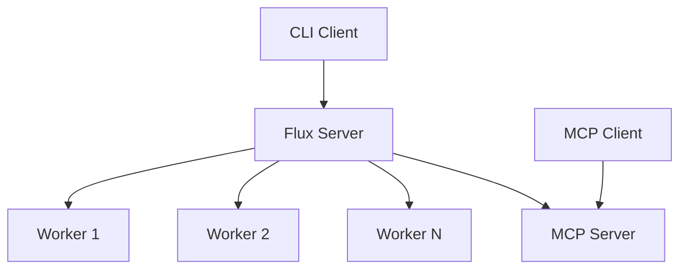

# Service Commands

The `flux start` command group provides commands to start various Flux services including the main server, workers, and Model Context Protocol (MCP) servers.

> 🚀 **Quick Start:** Follow our [Your First Workflow Tutorial](../tutorials/your-first-workflow.md) to learn how to start services and run workflows end-to-end.

## Command Overview

| Command | Description |
|---------|-------------|
| [`server`](#flux-start-server) | Start the main Flux server |
| [`worker`](#flux-start-worker) | Start a Flux worker process |
| [`mcp`](#flux-start-mcp) | Start a Model Context Protocol server |

---

## `flux start server`

Start the main Flux server that coordinates workflow execution and provides the REST API.

### Usage

```bash
flux start server [OPTIONS]
```

### Options

| Option | Short | Type | Default | Description |
|--------|-------|------|---------|-------------|
| `--host` | `-h` | string | `localhost` | Host address to bind the server to |
| `--port` | `-p` | integer | `8000` | Port number to bind the server to |

### Examples

**Start server with default settings:**
```bash
flux start server
```

**Start server on custom host and port:**
```bash
flux start server --host 0.0.0.0 --port 9000
```

**Start server accessible from all network interfaces:**
```bash
flux start server -h 0.0.0.0
```

### Server Configuration

The server reads configuration from the Flux configuration system. Command-line options override configuration file settings.

**Default Configuration:**
- Host: `localhost` (local access only)
- Port: `8000`
- API Base URL: `http://localhost:8000`

**Production Configuration Example:**
```bash
# Bind to all interfaces for external access
flux start server --host 0.0.0.0 --port 8080
```

### Server Features

The Flux server provides:

- **REST API** for workflow management
- **Workflow registration** and storage
- **Execution coordination** and monitoring
- **Task scheduling** and distribution
- **Real-time status** updates
- **Event streaming** for live monitoring

### Health Check

Once started, verify the server is running:

```bash
curl http://localhost:8000/health
```

Response:
```json
{
  "status": "healthy",
  "version": "1.0.0",
  "uptime": "00:05:23"
}
```

---

## `flux start worker`

Start a Flux worker process that connects to the server and executes workflow tasks.

### Usage

```bash
flux start worker [NAME] [OPTIONS]
```

### Arguments

| Argument | Type | Required | Description |
|----------|------|----------|-------------|
| `NAME` | string | No | Custom name for the worker (auto-generated if not provided) |

### Options

| Option | Short | Type | Default | Description |
|--------|-------|------|---------|-------------|
| `--server-url` | `-surl` | string | auto | Server URL to connect to |

### Examples

**Start worker with auto-generated name:**
```bash
flux start worker
```

Output:
```
Starting worker: worker-a1b2c3
Connected to server: http://localhost:8000
Worker ready for tasks...
```

**Start worker with custom name:**
```bash
flux start worker data-processor
```

**Connect worker to remote server:**
```bash
flux start worker --server-url http://production-server:8080
```

**Start multiple workers:**
```bash
# Terminal 1
flux start worker worker-01

# Terminal 2
flux start worker worker-02

# Terminal 3
flux start worker worker-03
```

### Worker Configuration

Workers automatically read server connection details from configuration, but can be overridden:

**Default Server Connection:**
- URL: `http://localhost:8000`
- Connection timeout: 30 seconds
- Heartbeat interval: 10 seconds

### Worker Capabilities

Workers provide:

- **Task execution** for workflow steps
- **Automatic reconnection** if server restarts
- **Load balancing** across multiple workers
- **Isolation** between task executions
- **Resource monitoring** and reporting
- **Error handling** and recovery

### Worker Monitoring

Workers report their status to the server. Check worker status via the server API:

```bash
curl http://localhost:8000/workers
```

Response:
```json
[
  {
    "name": "worker-a1b2c3",
    "status": "active",
    "connected_at": "2024-01-15T14:30:00Z",
    "tasks_completed": 42,
    "current_task": "data_processing_step_3"
  }
]
```

---

## `flux start mcp`

Start a Model Context Protocol (MCP) server that exposes Flux workflow capabilities as tools for AI assistants and other MCP clients.

### Usage

```bash
flux start mcp [OPTIONS]
```

### Options

| Option | Short | Type | Default | Description |
|--------|-------|------|---------|-------------|
| `--host` | `-h` | string | `localhost` | Host address to bind the MCP server to |
| `--port` | `-p` | integer | `3000` | Port number to bind the MCP server to |
| `--name` | `-n` | string | `flux-mcp` | Name for the MCP server |
| `--server-url` | `-surl` | string | auto | Flux server URL to connect to |
| `--transport` | `-t` | choice | `streamable-http` | Transport protocol (`stdio`, `streamable-http`, `sse`) |

### Transport Protocols

| Protocol | Description | Use Case |
|----------|-------------|----------|
| `stdio` | Standard input/output | Direct process communication |
| `streamable-http` | HTTP with streaming | Web-based integrations |
| `sse` | Server-Sent Events | Real-time web applications |

### Examples

**Start MCP server with default settings:**
```bash
flux start mcp
```

**Start MCP server on custom port:**
```bash
flux start mcp --port 4000
```

**Start MCP server with custom name and transport:**
```bash
flux start mcp --name ai-workflow-tools --transport sse
```

**Connect MCP server to remote Flux server:**
```bash
flux start mcp --server-url http://flux-server:8080
```

**Start MCP server for external access:**
```bash
flux start mcp --host 0.0.0.0 --port 3000
```

### MCP Server Capabilities

The MCP server exposes Flux functionality as tools:

- **Workflow execution** tools
- **Status monitoring** tools
- **Workflow management** tools
- **Real-time streaming** of execution events
- **Error handling** and reporting

### MCP Client Integration

AI assistants and other MCP clients can connect to use Flux workflows:

```json
{
  "mcpServers": {
    "flux": {
      "command": "flux",
      "args": ["start", "mcp"],
      "env": {
        "FLUX_SERVER_URL": "http://localhost:8000"
      }
    }
  }
}
```

### Available MCP Tools

The MCP server exposes these tools to clients:

| Tool | Description |
|------|-------------|
| `list_workflows` | List available workflows |
| `run_workflow` | Execute a workflow |
| `get_workflow_status` | Check execution status |
| `stream_workflow` | Stream real-time execution |

---

## Service Architecture

### Typical Deployment

**Single Machine Development:**
```bash
# Terminal 1: Start server
flux start server

# Terminal 2: Start worker
flux start worker

# Terminal 3: Use workflows
flux workflow list
```

**Production Deployment:**
```bash
# Server machine
flux start server --host 0.0.0.0 --port 8080

# Worker machines (multiple)
flux start worker worker-prod-01 --server-url http://server:8080
flux start worker worker-prod-02 --server-url http://server:8080

# MCP integration (optional)
flux start mcp --server-url http://server:8080 --host 0.0.0.0
```

### Service Dependencies



### High Availability

**Multiple Workers:**
- Distribute load across workers
- Automatic failover if worker stops
- Scale workers based on demand

**Server Clustering:**
- Run multiple server instances
- Use load balancer for distribution
- Shared storage for workflow state

## Process Management

### Background Services

**Using systemd (Linux):**
```bash
# Create service file
sudo tee /etc/systemd/system/flux-server.service << EOF
[Unit]
Description=Flux Workflow Server
After=network.target

[Service]
Type=simple
User=flux
ExecStart=/usr/local/bin/flux start server --host 0.0.0.0
Restart=always

[Install]
WantedBy=multi-user.target
EOF

sudo systemctl enable flux-server
sudo systemctl start flux-server
```

**Using Docker:**
```dockerfile
FROM python:3.12
RUN pip install flux-core
EXPOSE 8000
CMD ["flux", "start", "server", "--host", "0.0.0.0"]
```

**Using Docker Compose:**
```yaml
version: '3.8'
services:
  flux-server:
    image: flux-core
    ports:
      - "8000:8000"
    command: flux start server --host 0.0.0.0

  flux-worker:
    image: flux-core
    depends_on:
      - flux-server
    command: flux start worker --server-url http://flux-server:8000
    deploy:
      replicas: 3
```

### Monitoring Services

**Check service status:**
```bash
# Using systemctl
sudo systemctl status flux-server

# Using Docker
docker ps
docker logs flux-server

# Using process tools
ps aux | grep flux
netstat -tlnp | grep :8000
```

**Health monitoring:**
```bash
# Server health
curl http://localhost:8000/health

# Worker status
curl http://localhost:8000/workers

# MCP server status
curl http://localhost:3000/ping
```

## Troubleshooting

### Common Issues

**Server won't start:**
```bash
# Check if port is already in use
netstat -tlnp | grep :8000

# Start on different port
flux start server --port 8001
```

**Worker can't connect:**
```bash
# Verify server is running
curl http://localhost:8000/health

# Check server URL configuration
flux start worker --server-url http://localhost:8000
```

**Permission denied errors:**
```bash
# Run with appropriate user permissions
sudo -u flux flux start server

# Or adjust file permissions
chmod +x /usr/local/bin/flux
```

### Logging and Debugging

**Enable debug logging:**
```bash
export FLUX_LOG_LEVEL=DEBUG
flux start server
```

**Check log files:**
```bash
# Default log locations
tail -f ~/.flux/logs/server.log
tail -f ~/.flux/logs/worker.log
```

## See Also

### Getting Started
- **[Installation Guide](../getting-started/installation.md)** - Setting up Flux
- **[Quick Start Guide](../getting-started/quick-start-guide.md)** - First steps with Flux
- **[Your First Workflow Tutorial](../tutorials/your-first-workflow.md)** - Complete tutorial with service startup

### Core Concepts
- **[Execution Model](../core-concepts/execution-model.md)** - How Flux services work together
- **[Basic Concepts](../getting-started/basic_concepts.md)** - Understanding workflows and tasks

### Related Commands
- **[Workflow Commands](workflow.md)** - Managing workflows after services are started
- **[Secrets Management](secrets.md)** - Managing secrets for secure workflows

### Production & Troubleshooting
- **[Best Practices](../tutorials/best-practices.md)** - Production deployment guidelines
- **[Troubleshooting Guide](../tutorials/troubleshooting.md)** - Common service startup issues
- **[FAQ](../tutorials/faq.md)** - Frequently asked questions about services
