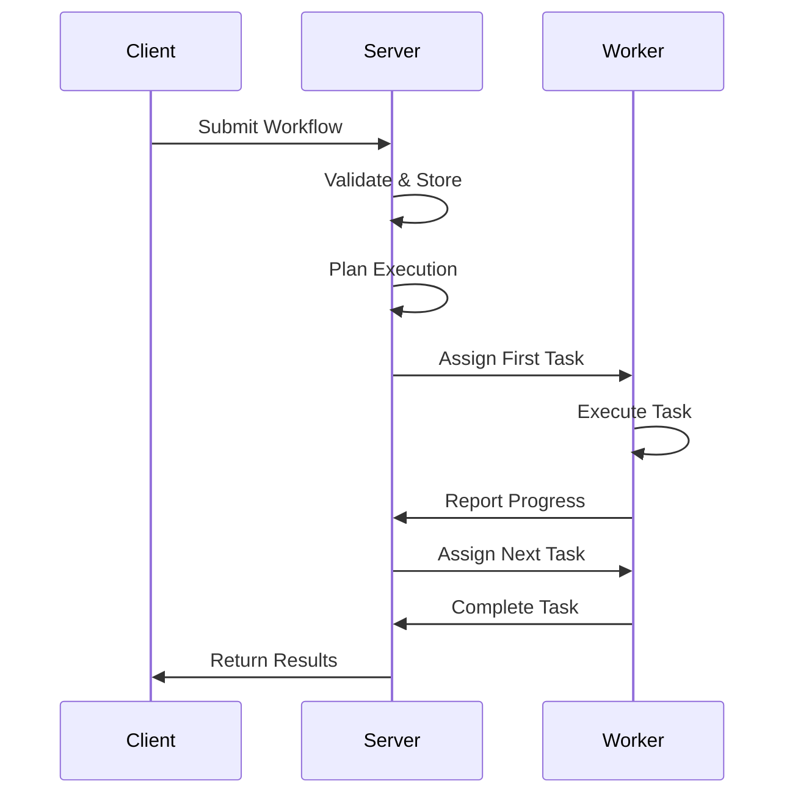
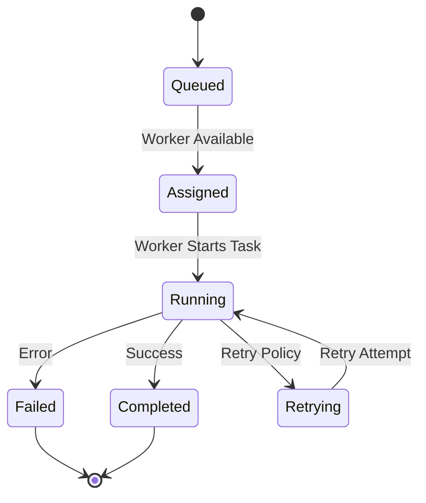

# Server Architecture

Understanding Flux's distributed architecture is essential for successful deployment and operation. This guide explains the server/worker model, component interactions, and architectural decisions.

## Core Components

### Flux Server
The Flux server acts as the central coordinator for workflow execution:

- **Workflow Registry**: Stores and manages workflow definitions
- **Execution Engine**: Coordinates task execution across workers
- **State Manager**: Maintains workflow and task state
- **Scheduler**: Assigns tasks to available workers
- **API Gateway**: Provides HTTP and MCP interfaces

### Flux Workers
Workers are the execution units that run individual tasks:

- **Task Executor**: Runs individual workflow tasks
- **Resource Manager**: Manages CPU, memory, and I/O resources
- **Communication Layer**: Maintains connection with server
- **Isolation Engine**: Provides task execution isolation

### Communication Layer
The server and workers communicate through:

- **Control Plane**: Task assignment and status updates
- **Data Plane**: Task input/output data transfer
- **Heartbeat System**: Health monitoring and failure detection

## Architecture Patterns

### Hub-and-Spoke Model
```
    [Worker 1]
         |
    [Worker 2] ← → [Flux Server] ← → [Client Applications]
         |
    [Worker 3]
```

**Advantages:**
- Simple coordination and management
- Centralized state and monitoring
- Easy to implement and debug

**Considerations:**
- Server becomes potential bottleneck
- Single point of failure (mitigated by HA setup)

### Distributed State Management

#### Workflow State
```python
# Workflow execution state hierarchy
Workflow Instance
├── Execution Metadata
│   ├── Start Time
│   ├── Current Status
│   └── Resource Usage
├── Task States
│   ├── Pending Tasks
│   ├── Running Tasks
│   └── Completed Tasks
└── Context Data
    ├── Input Parameters
    ├── Intermediate Results
    └── Final Outputs
```

#### State Persistence
- **In-Memory State**: Fast access for active workflows
- **Persistent Storage**: Durable state for recovery
- **State Replication**: Multi-node consistency (HA mode)

## Component Interactions

### Workflow Submission Flow


### Task Execution Lifecycle


## Scalability Considerations

### Horizontal Scaling

#### Adding Workers
```bash
# Scale workers based on load
flux start worker --server-host=flux-server:8000 --workers=4
flux start worker --server-host=flux-server:8000 --workers=8 --node-label=gpu
```

#### Worker Specialization
```python
# GPU-specific worker configuration
@task(node_selector={"hardware": "gpu"})
def train_model(data: Dataset) -> Model:
    """Run on GPU-enabled workers only"""
    return train_neural_network(data)

@task(node_selector={"memory": "high"})
def process_large_dataset(data: LargeDataset) -> ProcessedData:
    """Run on high-memory workers"""
    return process_data(data)
```

### Load Distribution

#### Task Scheduling Strategies
- **Round Robin**: Even distribution across workers
- **Load-Based**: Assign to least loaded worker
- **Affinity-Based**: Keep related tasks on same worker
- **Resource-Based**: Match task requirements to worker capabilities

#### Example Configuration
```yaml
# Server configuration for load balancing
server:
  scheduler:
    strategy: "load_based"
    load_threshold: 0.8
    task_affinity: true

  resource_matching:
    enabled: true
    strict_requirements: false
```

## Resource Management

### Worker Resource Allocation
```python
# Configure worker resource limits
@task(
    cpu_limit="2.0",      # 2 CPU cores
    memory_limit="4Gi",   # 4GB memory
    timeout=300          # 5 minute timeout
)
def resource_intensive_task(data: LargeData) -> Result:
    return process_with_limits(data)
```

### Resource Isolation
- **Process Isolation**: Each task runs in separate process
- **Resource Limits**: CPU, memory, and I/O constraints
- **Network Isolation**: Task-level network access control

## Fault Tolerance

### Server Fault Tolerance
```yaml
# High availability configuration
high_availability:
  enabled: true
  replica_count: 3
  consensus_algorithm: "raft"

  persistence:
    backend: "postgresql"
    replication: true
    backup_interval: "1h"
```

### Worker Fault Tolerance
- **Health Monitoring**: Regular heartbeat checks
- **Graceful Shutdown**: Complete in-flight tasks before stopping
- **Automatic Recovery**: Restart failed tasks on healthy workers
- **Circuit Breaker**: Isolate problematic workers

### Example Recovery Configuration
```python
@task(
    retry_policy=RetryPolicy(
        max_attempts=3,
        backoff=ExponentialBackoff(initial=1.0, max=60.0)
    ),
    timeout=TimeoutPolicy(execution=300, total=900)
)
def resilient_task(input_data: Data) -> Result:
    """Task with comprehensive fault tolerance"""
    return process_data(input_data)
```

## Security Architecture

### Network Security
```yaml
# Network configuration
network:
  tls:
    enabled: true
    cert_file: "/etc/flux/tls/server.crt"
    key_file: "/etc/flux/tls/server.key"

  authentication:
    method: "token"
    token_expiry: "24h"
```

### Access Control
- **Role-Based Access**: Different permissions for different users
- **API Key Management**: Secure API access
- **Task Isolation**: Prevent cross-task data access

## Monitoring and Observability

### Built-in Metrics
```python
# Server exposes metrics at /metrics endpoint
- workflow_executions_total
- task_duration_seconds
- worker_utilization_percent
- queue_depth_gauge
- error_rate_percent
```

### Distributed Tracing
```python
# Automatic trace propagation across components
@task(trace=True)
def traced_task(ctx: ExecutionContext, data: Data) -> Result:
    # Trace context automatically propagated
    with ctx.span("processing"):
        return process_data(data)
```

## Performance Optimization

### Connection Pooling
```yaml
# Worker connection management
worker:
  connection_pool:
    max_connections: 100
    keepalive_timeout: 30
    retry_backoff: [1, 2, 4, 8]
```

### Batching and Caching
```python
# Optimize task execution with batching
@task(batch_size=10, cache_ttl=3600)
def batch_processed_task(items: List[Item]) -> List[Result]:
    """Process items in batches with caching"""
    return [process_item(item) for item in items]
```

## Deployment Topologies

### Single-Node Development
```
[Client] → [Flux Server + Worker] (localhost)
```

### Multi-Node Production
```
[Load Balancer]
       ↓
[Flux Server Cluster]
       ↓
[Worker Pool A] [Worker Pool B] [Worker Pool C]
```

### Cloud-Native Deployment
```
[Ingress Controller]
       ↓
[Flux Server Pods]
       ↓
[Worker Deployment] (Auto-scaling)
```

## Best Practices

### Server Configuration
1. **Resource Planning**: Size server based on concurrent workflows
2. **State Persistence**: Use external database for production
3. **Monitoring Setup**: Configure comprehensive monitoring
4. **Backup Strategy**: Regular state backups

### Worker Configuration
1. **Resource Limits**: Set appropriate CPU/memory limits
2. **Specialization**: Use different worker types for different workloads
3. **Health Checks**: Configure proper health monitoring
4. **Graceful Shutdown**: Allow tasks to complete during restarts

### Network Configuration
1. **TLS Encryption**: Enable TLS for all communications
2. **Firewall Rules**: Restrict access to necessary ports only
3. **Load Balancing**: Use load balancers for high availability
4. **DNS Setup**: Proper service discovery configuration

## Next Steps

- **[Server Setup](server-setup.md)** - Detailed server configuration
- **[Worker Management](worker-management.md)** - Worker deployment and scaling
- **[Network Configuration](network-configuration.md)** - Network setup and security
- **[High Availability](high-availability.md)** - HA deployment patterns

## See Also

- **[Performance Tuning](../performance/performance-monitoring.md)** - Optimizing performance
- **[Security Guide](../user-guide/security.md)** - Security best practices
- **[Troubleshooting](../reference/troubleshooting/common-issues.md)** - Common issues and solutions
