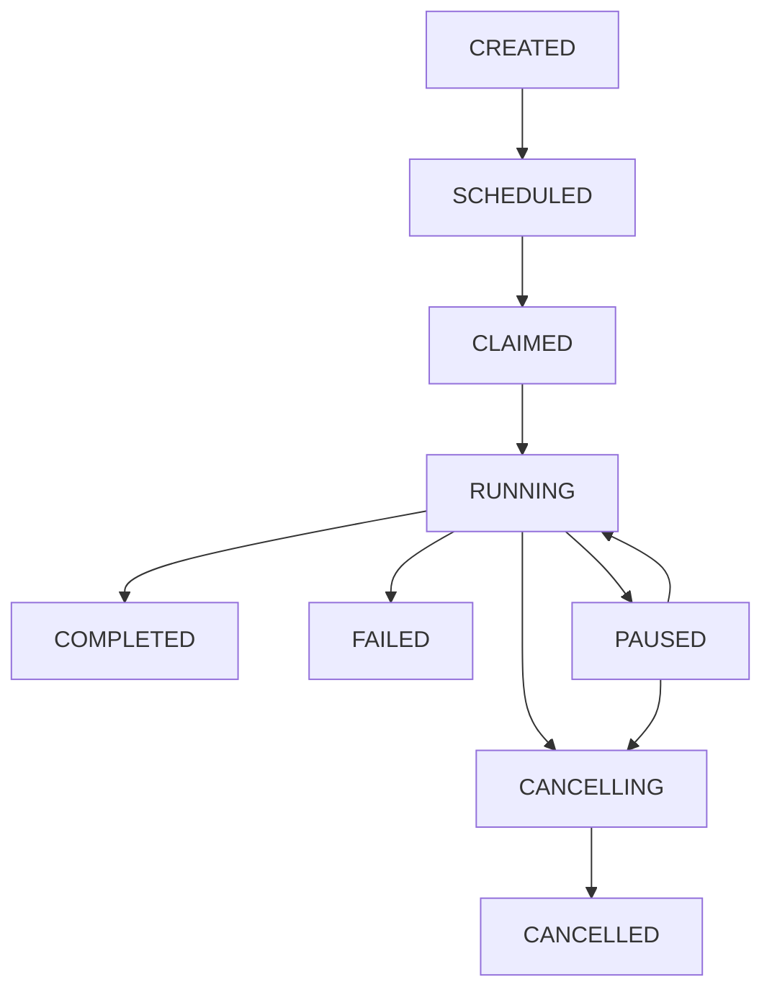

# Execution Context

The **Execution Context** (`ExecutionContext`) is the central coordination mechanism in Flux workflows. It serves as the state container that maintains all information about a workflow execution, from start to completion. Every workflow receives an execution context as its first parameter, providing access to input data, execution metadata, state tracking, and event history.

## Overview

The execution context is automatically created when a workflow starts and persists throughout the entire execution lifecycle. It provides:

- **State Management**: Tracks workflow progress and current execution state
- **Data Access**: Provides input data and collects output results
- **Event Tracking**: Maintains a complete audit trail of execution events
- **Control Mechanisms**: Enables pause/resume and cancellation operations
- **Worker Information**: Tracks which worker is executing the workflow

## Basic Usage

Every workflow function must accept an `ExecutionContext` as its first parameter:

```python
from flux import workflow, ExecutionContext

@workflow
async def my_workflow(ctx: ExecutionContext[str]):
    # Access input data
    user_input = ctx.input

    # Get execution metadata
    execution_id = ctx.execution_id
    workflow_name = ctx.workflow_name

    # Process and return result
    result = await process_data(user_input)
    return result
```

### Type Safety

The execution context supports generic typing to specify the expected input type:

```python
@workflow
async def typed_workflow(ctx: ExecutionContext[dict]):
    # ctx.input is now typed as dict
    name = ctx.input["name"]
    age = ctx.input["age"]
    return f"{name} is {age} years old"

@workflow
async def list_workflow(ctx: ExecutionContext[list[str]]):
    # ctx.input is typed as list[str]
    items = ctx.input
    return [item.upper() for item in items]
```

## Core Properties

### Execution Identification

```python
@workflow
async def identification_example(ctx: ExecutionContext):
    # Unique execution identifier
    execution_id = ctx.execution_id

    # Workflow metadata
    workflow_name = ctx.workflow_name
    workflow_id = ctx.workflow_id

    # Worker information
    current_worker = ctx.current_worker

    print(f"Execution {execution_id} of {workflow_name} on {current_worker}")
```

### Data Access

```python
@workflow
async def data_access_example(ctx: ExecutionContext[dict]):
    # Input data provided to the workflow
    input_data = ctx.input

    # Output data is only available after workflow completion
    # During execution, ctx.output is None
    # The output will be populated when the workflow returns

    processed_data = {"processed": input_data}

    # The return value becomes ctx.output for subsequent calls
    return processed_data

# Example of accessing output after workflow completion
ctx = data_access_example.run({"name": "John", "age": 30})
if ctx.has_finished and ctx.has_succeeded:
    output_data = ctx.output
    print(f"Workflow completed with output: {output_data}")
```

### State Information

```python
@workflow
async def state_example(ctx: ExecutionContext):
    # Execution status checks
    is_finished = ctx.has_finished      # True if completed/failed/cancelled
    has_succeeded = ctx.has_succeeded   # True if completed successfully
    has_failed = ctx.has_failed         # True if failed with error
    is_paused = ctx.is_paused          # True if currently paused
    is_cancelled = ctx.is_cancelled     # True if cancelled
    is_claimed = ctx.is_claimed         # True if claimed by worker
    has_started = ctx.has_started       # True if execution has begun

    if ctx.has_finished:
        if ctx.has_succeeded:
            print("Workflow completed successfully")
        elif ctx.has_failed:
            print("Workflow failed")
        elif ctx.is_cancelled:
            print("Workflow was cancelled")
```

## Execution States

The execution context tracks workflows through a well-defined state lifecycle:

### State Transitions



### State Descriptions

- **CREATED**: Initial state when execution context is created
- **SCHEDULED**: Workflow is assigned to a worker but not yet started
- **CLAIMED**: Worker has claimed the execution and is ready to start
- **RUNNING**: Workflow is actively executing tasks
- **PAUSED**: Execution paused at a designated pause point
- **COMPLETED**: Workflow finished successfully with results
- **FAILED**: Workflow terminated due to an unrecoverable error
- **CANCELLING**: Cancellation initiated, cleanup in progress
- **CANCELLED**: Workflow was cancelled and cleanup completed

## Event System

The execution context automatically tracks events throughout the workflow lifecycle, providing a complete audit trail.

### Event Types

```python
from flux.domain.events import ExecutionEventType

# Workflow lifecycle events
ExecutionEventType.WORKFLOW_STARTED     # Workflow begins execution
ExecutionEventType.WORKFLOW_COMPLETED   # Workflow completes successfully
ExecutionEventType.WORKFLOW_FAILED      # Workflow fails with error
ExecutionEventType.WORKFLOW_PAUSED      # Workflow is paused
ExecutionEventType.WORKFLOW_RESUMED     # Workflow is resumed
ExecutionEventType.WORKFLOW_CANCELLED   # Workflow is cancelled

# Task execution events
ExecutionEventType.TASK_STARTED         # Task begins execution
ExecutionEventType.TASK_COMPLETED       # Task completes successfully
ExecutionEventType.TASK_FAILED          # Task fails with error

# Error handling events
ExecutionEventType.TASK_RETRY_STARTED   # Task retry begins
ExecutionEventType.TASK_FALLBACK_STARTED # Task fallback begins
ExecutionEventType.TASK_ROLLBACK_STARTED # Task rollback begins
```

### Accessing Events

```python
from flux import task

@task
async def process_data(data: str):
    return data.upper()

@task
async def validate_data(data: str):
    if len(data) < 3:
        raise ValueError("Data too short")
    return data

@workflow
async def event_inspection(ctx: ExecutionContext[str]):
    # This workflow has actual tasks, so it will generate task events

    # Access all events so far
    print(f"Events at start: {len(ctx.events)}")

    # Execute some tasks
    validated = await validate_data(ctx.input)
    processed = await process_data(validated)

    # Now we have events to inspect
    all_events = ctx.events

    # Filter for workflow events
    workflow_events = [
        event for event in ctx.events
        if event.type.name.startswith('WORKFLOW_')
    ]

    # Filter for task events
    task_events = [
        event for event in ctx.events
        if event.type.name.startswith('TASK_')
    ]

    print(f"Total events: {len(all_events)}")
    print(f"Workflow events: {len(workflow_events)}")
    print(f"Task events: {len(task_events)}")

    # Iterate through recent events
    for event in ctx.events[-5:]:  # Last 5 events
        print(f"Event: {event.type.name}")
        print(f"Source: {event.source_id}")

    return processed
```

## Workflow Control

### Pause and Resume

The execution context supports workflow pausing for manual intervention or approval workflows:

```python
from flux.tasks import pause

@workflow
async def approval_workflow(ctx: ExecutionContext[str]):
    # Process initial data
    data = await validate_data(ctx.input)

    # Pause for manual approval
    await pause("manual_approval")

    # Execution continues here after resume
    result = await finalize_data(data)
    return result

# First execution - runs until pause point
ctx = approval_workflow.run("some_data")
print(f"Paused: {ctx.is_paused}")  # True

# Resume execution with the same execution_id
ctx = approval_workflow.run(execution_id=ctx.execution_id)
print(f"Completed: {ctx.has_finished}")  # True
```

### Multiple Pause Points

```python
@workflow
async def multi_stage_workflow(ctx: ExecutionContext):
    # Stage 1
    data = await prepare_data(ctx.input)
    await pause("verify_data")

    # Stage 2
    processed = await process_data(data)
    await pause("review_processing")

    # Stage 3
    result = await finalize_data(processed)
    return result
```

## State Persistence

The execution context automatically persists its state to ensure durability and fault tolerance:

### Automatic Checkpointing

```python
@workflow
async def persistent_workflow(ctx: ExecutionContext):
    # State is automatically saved after each step
    step1_result = await task_one()
    # Checkpoint saved here

    step2_result = await task_two(step1_result)
    # Checkpoint saved here

    final_result = await task_three(step2_result)
    # Final checkpoint saved here

    return final_result
```

### Recovery and Replay

If a workflow is interrupted, Flux can recover and replay from the last checkpoint:

```python
# Original execution gets interrupted
ctx = my_workflow.run("input_data")

# Recovery by replaying with the same execution_id
# Only missing steps will be executed
recovered_ctx = my_workflow.run(execution_id=ctx.execution_id)
```

## Best Practices

### 1. Always Use Type Hints

```python
@workflow
async def well_typed_workflow(ctx: ExecutionContext[dict[str, str]]):
    # Clear expectations about input format
    name = ctx.input["name"]
    email = ctx.input["email"]
    return f"User {name} with email {email}"
```

### 2. Check Execution State When Needed

```python
@workflow
async def robust_workflow(ctx: ExecutionContext):
    if ctx.has_failed:
        # Handle previous failure case
        return handle_recovery()

    if ctx.is_paused:
        # Resume from pause point
        return resume_processing()

    # Normal execution
    return await normal_processing()
```

### 3. Use Events for Monitoring

```python
@workflow
async def monitored_workflow(ctx: ExecutionContext):
    # Track progress through events
    task_events = [
        e for e in ctx.events
        if e.type in [ExecutionEventType.TASK_COMPLETED, ExecutionEventType.TASK_FAILED]
    ]

    progress = len([e for e in task_events if e.type == ExecutionEventType.TASK_COMPLETED])
    failures = len([e for e in task_events if e.type == ExecutionEventType.TASK_FAILED])

    print(f"Progress: {progress} completed, {failures} failed")

    result = await next_task()
    return result
```

### 4. Handle Edge Cases

```python
@workflow
async def defensive_workflow(ctx: ExecutionContext):
    # Validate input
    if ctx.input is None:
        raise ValueError("Input cannot be None")

    # Check if workflow was previously cancelled
    if ctx.is_cancelled:
        return "Workflow was cancelled"

    # Proceed with normal execution
    return await process_input(ctx.input)
```

## Summary

The execution context is fundamental to understanding how Flux workflows operate:

- **Always the first parameter** in workflow functions
- **Provides complete execution state** and metadata
- **Enables advanced features** like pause/resume and state persistence
- **Tracks comprehensive event history** for monitoring and debugging
- **Supports type safety** through generic typing
- **Handles state persistence** automatically for fault tolerance

Understanding the execution context is crucial for building robust, stateful workflows that can handle complex execution scenarios, recover from failures, and provide comprehensive monitoring capabilities.
