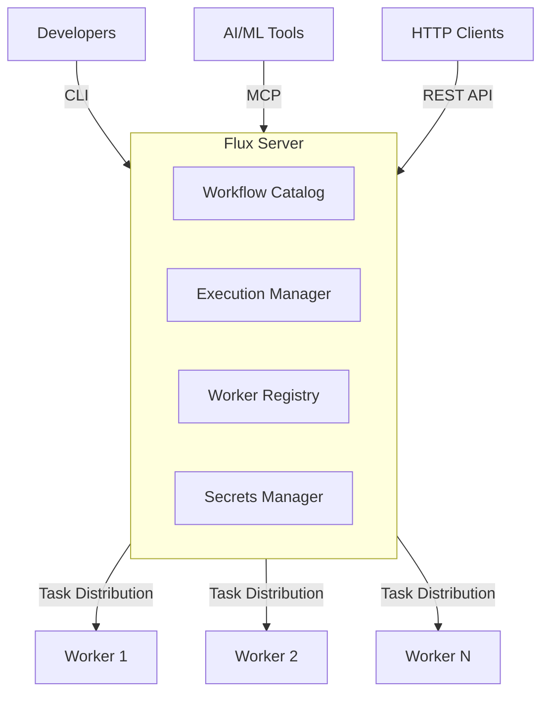
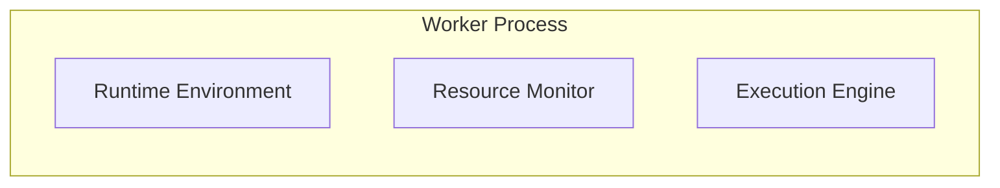
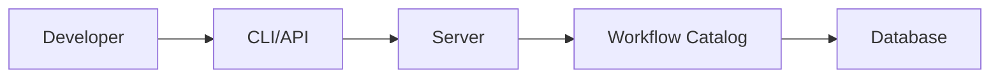
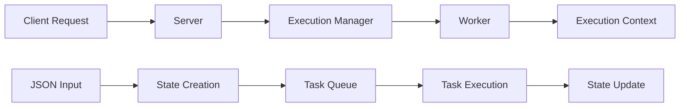
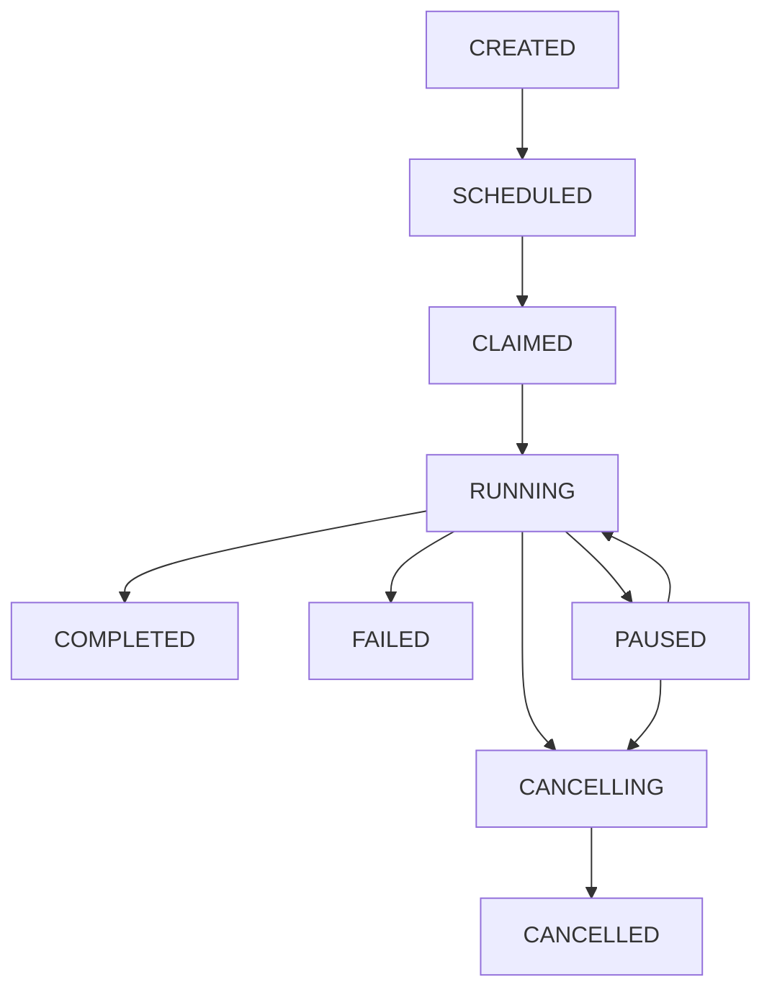

# Architecture Overview

Flux is a distributed workflow orchestration engine designed for building stateful and fault-tolerant workflows. This document provides a high-level overview of the system architecture, core components, and design principles.

## System Overview

Flux employs a modern distributed architecture that separates concerns between workflow definition, orchestration, and execution. The system is designed around the principles of resilience, scalability, and developer experience.

## Core Components

### 1. Flux Server

The central coordination hub that manages workflows, executions, and worker nodes.

#### Key Responsibilities:
- **Workflow Management**: Store, version, and serve workflow definitions
- **Execution Orchestration**: Schedule and monitor workflow executions
- **Worker Coordination**: Manage worker registration and task distribution
- **State Management**: Persist execution state and handle fault recovery
- **API Gateway**: Provide REST API and streaming interfaces

#### Sub-components:
- **Workflow Catalog**: Database-based storage for workflow definitions and metadata
- **Execution Manager**: Handles execution context lifecycle and state transitions
- **Worker Registry**: Tracks available workers and their capabilities
- **Secret Manager**: Secure storage and retrieval of sensitive configuration

### 2. Worker Nodes

Distributed execution units that run workflow tasks.

#### Key Responsibilities:
- **Task Execution**: Execute workflow functions in isolated environments
- **Resource Management**: Monitor and report CPU, memory, and GPU availability
- **State Checkpointing**: Persist intermediate results and execution state
- **Package Management**: Maintain Python environment and dependencies

#### Worker Architecture:

### 3. Execution Context

The core data structure that maintains workflow state throughout execution.

#### State Components:
- **Execution Metadata**: Unique IDs, workflow references, timestamps
- **Input/Output Data**: Serialized workflow parameters and results
- **Event History**: Complete audit trail of execution events
- **State Transitions**: Current execution state and lifecycle tracking

#### State Persistence:
- Database for durable storage
- Event sourcing for complete execution history
- Automatic checkpointing for fault tolerance
- State compression for large workflows

### 4. Communication Layer

Multiple communication protocols for different use cases.

#### HTTP API:
- RESTful endpoints for workflow management
- Synchronous and asynchronous execution modes
- Server-Sent Events (SSE) for real-time streaming
- OpenAPI/Swagger documentation

#### Model Context Protocol (MCP):
- Integration with AI development tools
- Tool-based interface for workflow operations
- Support for stdio, HTTP, and SSE transports
- Structured JSON responses for AI consumption

#### Worker Communication:
- Server-Sent Events for task distribution
- HTTP for worker registration and heartbeat
- JSON-based message protocol
- Automatic reconnection and fault tolerance

## Data Flow Architecture

### 1. Workflow Registration

1. Developer uploads Python workflow file
2. Server parses and validates workflow syntax
3. Workflow metadata extracted (imports, functions, decorators)
4. Version management and storage in catalog
5. Worker capability matching for resource requirements

### 2. Execution Flow

#### Detailed Steps:
1. **Request Initiation**: Client submits workflow execution request
2. **Context Creation**: Server creates execution context with unique ID
3. **Resource Matching**: Find suitable worker based on requirements
4. **Task Distribution**: Send workflow and context to worker via SSE
5. **Execution**: Worker runs workflow in isolated environment
6. **Checkpointing**: Periodic state saves during execution
7. **Completion**: Final state update and result return

### 3. State Management

#### State Transitions:
1. **CREATED**: Initial state when execution context is created
2. **SCHEDULED**: Worker assigned but execution not yet claimed
3. **CLAIMED**: Worker has claimed the execution and is ready to start
4. **RUNNING**: Workflow is actively executing tasks
5. **PAUSED**: Execution paused at a designated pause point, can resume
6. **CANCELLING**: Cancellation initiated, cleanup in progress
7. **COMPLETED**: Workflow finished successfully with results
8. **FAILED**: Workflow terminated due to unrecoverable error
9. **CANCELLED**: Workflow was cancelled and cleanup completed

#### Key Flows:
- **Normal Execution**: CREATED → SCHEDULED → CLAIMED → RUNNING → COMPLETED
- **Pause/Resume Cycle**: RUNNING ↔ PAUSED (workflows can pause and resume multiple times)
- **Cancellation**: RUNNING/PAUSED → CANCELLING → CANCELLED
- **Error Handling**: RUNNING → FAILED (terminal state)

## Scalability and Fault Tolerance

### Horizontal Scaling

#### Worker Scaling:
- Dynamic worker registration and discovery
- Automatic load balancing across available workers
- Resource-aware task assignment
- Independent worker scaling without server restart

#### Data Layer Scaling:
- Configurable persistence backend for different deployment needs
- Connection pooling for concurrent access
- Optimized queries for workflow and execution retrieval
- Event-based architecture for loose coupling
- Support for both embedded and distributed database solutions

### Fault Tolerance

#### Worker Failures:
- Automatic task reassignment to healthy workers
- Worker health monitoring and timeout detection
- Graceful degradation when workers become unavailable
- Persistent task queues for reliability

#### Server Resilience:
- Stateless server design for easy restart
- Persistent storage for all critical state
- Event sourcing for complete execution history
- Automatic recovery of in-progress executions

#### Network Partitions:
- Worker reconnection with exponential backoff
- Message deduplication and idempotency
- Checkpoint-based recovery mechanisms
- Graceful handling of temporary disconnections

## Security Architecture

### Authentication and Authorization

#### Worker Security:
- Bootstrap tokens for initial worker registration
- Session tokens for ongoing communication
- Token rotation for enhanced security
- Capability-based access control

#### API Security:
- HTTP-based authentication for REST endpoints
- CORS configuration for web client access
- Rate limiting and request validation
- Secure secret management

### Data Protection

#### Secrets Management:
- Encrypted storage using AES encryption
- Key derivation with PBKDF2
- Secure secret distribution to workers
- Audit logging for secret access

#### Data Serialization:
- Dill-based Python object serialization
- Base64 encoding for binary data transport
- Compression for large workflow definitions
- Integrity validation for stored data

## Performance Characteristics

### Execution Performance

#### Task Execution:
- Lazy evaluation and result caching
- Parallel execution where possible
- Minimal serialization overhead
- Optimized memory usage patterns

#### State Management:
- Efficient database operations
- Batch event processing
- Compressed state storage
- Connection pooling

### Resource Optimization

#### Memory Management:
- Streaming data processing where possible
- Garbage collection optimization
- Resource cleanup after execution
- Memory-efficient state representation

#### Network Efficiency:
- Binary protocols for large data transfer
- Message compression for SSE streams
- Connection reuse and pooling
- Adaptive timeout management

## Development and Debugging

### Observability

#### Execution Tracing:
- Complete event history for each execution
- Structured logging throughout the system
- Performance metrics and timing data
- Error tracking and stack traces

#### Monitoring Capabilities:
- Real-time execution status via SSE
- Worker health and resource monitoring
- System metrics and performance data
- Alert mechanisms for failures

### Developer Experience

#### Local Development:
- Single-process execution mode
- Hot reloading for workflow changes
- Interactive debugging capabilities
- Comprehensive error messages

#### Testing and Validation:
- Unit test framework integration
- Workflow validation and syntax checking
- Deterministic execution for testing
- Mock worker capabilities
