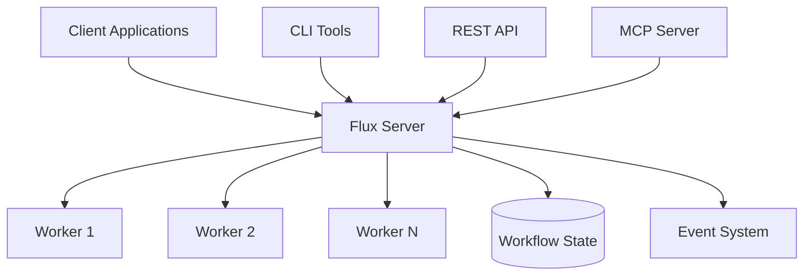

# Overview

Flux is a distributed workflow orchestration engine designed to build stateful and fault-tolerant workflows in Python. It provides a robust framework for creating, managing, and executing complex workflows with built-in support for error handling, retries, and state management.

## What is Flux?

Flux is a Python-based workflow orchestration system that transforms the way you build and manage complex processes. Unlike traditional task queues or simple automation tools, Flux provides a comprehensive framework for creating reliable, scalable, and maintainable workflows that can handle real-world complexity.

### Core Philosophy

Flux is built on the principle that **workflows should be code**. Instead of writing YAML configurations or using visual drag-and-drop interfaces, you define your workflows using familiar Python syntax with decorators. This approach brings several advantages:

- **Developer-Friendly**: Write workflows in the same language as your business logic
- **Version Control**: Track workflow changes using standard Git workflows
- **Testing**: Apply unit testing, integration testing, and CI/CD practices
- **Debugging**: Use familiar Python debugging tools and techniques
- **IDE Support**: Full autocomplete, type checking, and refactoring support

### Key Capabilities

Flux enables you to:

**🏗️ Build Complex Workflows**
- Define workflows as Python code using intuitive decorators
- Break down complex processes into manageable, reusable tasks
- Create sophisticated task dependencies and execution flows
- Compose workflows from smaller, testable components

**🛡️ Handle Failures Gracefully**
- Implement automatic retries with configurable backoff strategies
- Define fallback mechanisms for critical failure scenarios
- Roll back failed operations with custom recovery logic
- Set task timeouts to prevent hanging processes

**💾 Maintain State Reliably**
- Persist workflow state across executions and system restarts
- Create checkpoints in long-running workflows
- Resume workflows from their last successful state
- Track all workflow events for auditing and debugging

**📈 Scale Seamlessly**
- Start with local development and testing
- Deploy to distributed systems without code changes
- Scale workers horizontally based on demand
- Handle high-throughput scenarios with parallel processing

## Architecture Overview

Flux follows a distributed architecture that separates concerns and enables flexible deployment patterns:



### Components

**Flux Server**: Central coordinator that manages workflow registration, execution scheduling, and state persistence. Provides REST API and handles client requests.

**Workers**: Distributed execution engines that pull tasks from the server and execute them. Workers can be scaled horizontally and are stateless for maximum flexibility.

**CLI Tools**: Command-line interface for workflow management, server administration, and development workflows.

**REST API**: HTTP-based API for programmatic access, enabling integration with external systems and web applications.

**MCP Server**: Model Context Protocol server that exposes Flux capabilities as tools for AI assistants and automation platforms.

## Why Choose Flux?

### Compared to Traditional Solutions

**vs. Celery/RQ (Task Queues)**
- Flux provides workflow orchestration, not just task execution
- Built-in state management and fault tolerance
- Visual workflow monitoring and debugging
- No need for separate message brokers

**vs. Airflow/Prefect (Workflow Engines)**
- Code-first approach vs. configuration-driven
- Lighter weight and easier to deploy
- Better developer experience with full Python integration
- No complex UI setup required

**vs. AWS Step Functions/Azure Logic Apps (Cloud Services)**
- No vendor lock-in
- Run anywhere - local, cloud, or hybrid
- No proprietary workflow languages
- Full control over execution environment

### When to Use Flux

Flux is ideal for scenarios where you need:

- **Reliable Automation**: Critical business processes that must complete successfully
- **Complex Logic**: Multi-step workflows with conditional branching and loops
- **Error Recovery**: Processes that need sophisticated error handling and retry logic
- **State Management**: Long-running workflows that need to maintain state across executions
- **Developer Productivity**: Teams that want to apply software engineering best practices to workflows
- **Scalability**: Solutions that need to scale from development to production workloads

## Getting Started Journey

### 1. **Quick Start** (5 minutes)
Install Flux and run your first workflow locally:
```bash
pip install flux-core
flux start server  # Start in one terminal
flux start worker  # Start in another terminal
```

### 2. **First Workflow** (15 minutes)
Create a simple data processing workflow:
```python
from flux import workflow, task

@task
def fetch_data(source: str) -> list:
    # Fetch data from source
    return data

@task
def process_data(data: list) -> dict:
    # Transform and analyze data
    return results

@workflow
def data_pipeline(source: str):
    raw_data = fetch_data(source)
    results = process_data(raw_data)
    return results
```

### 3. **Production Deployment** (30 minutes)
Deploy to your production environment with proper configuration, monitoring, and scaling.

### 4. **Advanced Features** (Ongoing)
Explore advanced capabilities like parallel processing, error handling, secrets management, and workflow composition.

## Community and Support

Flux is an open-source project with an active community:

- **GitHub Repository**: [edurdias/flux](https://github.com/edurdias/flux)
- **Documentation**: Comprehensive guides and API reference
- **Examples**: Real-world workflow examples and patterns
- **Issues**: Bug reports and feature requests
- **Discussions**: Community questions and best practices

## Next Steps

Ready to dive deeper? Choose your learning path:

### 🚀 Get Started Quickly
- **[Installation](../getting-started/installation.md)** - Set up your development environment
- **[Your First Workflow Tutorial](../tutorials/your-first-workflow.md)** - Build and run a workflow in minutes
- **[Quick Start Guide](../getting-started/quick-start-guide.md)** - Essential concepts to get productive fast

### 📚 Learn the Concepts
- **[Basic Concepts](../getting-started/basic_concepts.md)** - Understand workflows, tasks, and execution
- **[Key Features](features.md)** - Detailed feature overview with code examples
- **[Use Cases](use-cases.md)** - Real-world scenarios where Flux excels

### 🔧 Practical Learning
- **[Working with Tasks Tutorial](../tutorials/working-with-tasks.md)** - Master task design and composition
- **[Parallel Processing Tutorial](../tutorials/parallel-processing.md)** - Optimize workflow performance
- **[Best Practices](../tutorials/best-practices.md)** - Production-ready development patterns

### 📖 Reference Materials
- **[CLI Reference](../cli/index.md)** - Master the command-line tools
- **[Core Concepts](../core-concepts/workflow-management.md)** - In-depth architecture and patterns
- **[Troubleshooting](../tutorials/troubleshooting.md)** - Solutions to common issues
